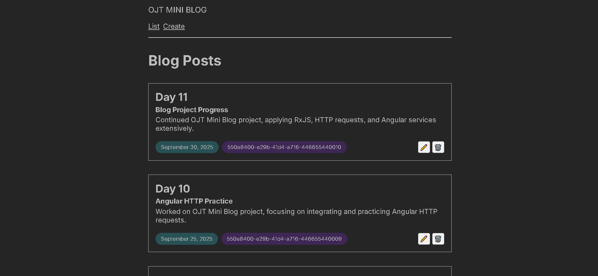
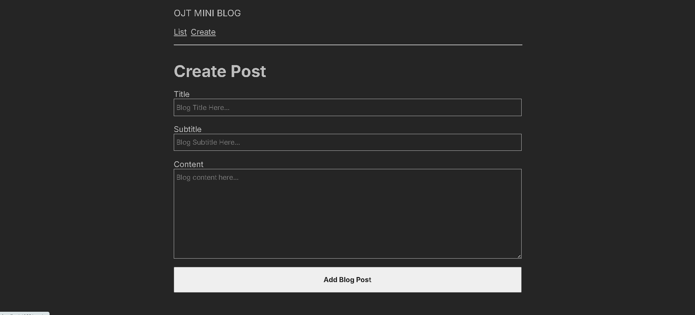
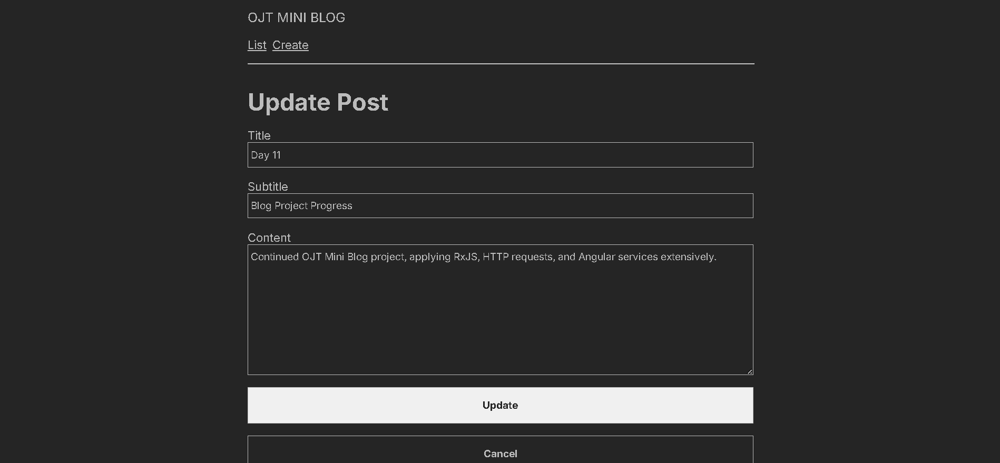

# 📝 OJT Mini Blog (Angular Project)

This is a simple **mini blog website** built with Angular as part of an OJT (On-the-Job Training) learning project.  
It demonstrates the use of Angular concepts such as **components, services, pipes, routing, forms, RxJS observables, and CRUD operations** with a local `json-server` backend.

---

## 🚀 Features
- **List Page** → view all blog posts  
- **Create Page** → add a new blog post  
- **Update Page** → edit existing blog posts  
- **Delete Functionality** → remove posts  
- Uses **Reactive Forms** for validation  
- Handles **HTTP requests** with Angular `HttpClient`  
- Demonstrates **RxJS** (`Observable`, `subscribe`, `pipe`)  
- Example of custom **Angular Pipe** for data formatting  

---

## 📸 Screenshots

### Blog List Page

### Create Blog Page

### Update Blog Page

---

## ▶️ How to Run

1. **Clone this repo:**
   git clone <your-repo-url>
   cd ojt-mini-blog
2. **Install dependencies:**
   npm install
3. **Install json-server globally (if not already installed):**
   npm install -g json-server
4. **Run json-server with sample data:**
   json-server --watch db.json --port 3000
4. **Run Angular app in a separate terminal:**
   ng serve
4. **Open the app in your browser:**
   Navigate to http://localhost:4200/list to view the blog posts.
